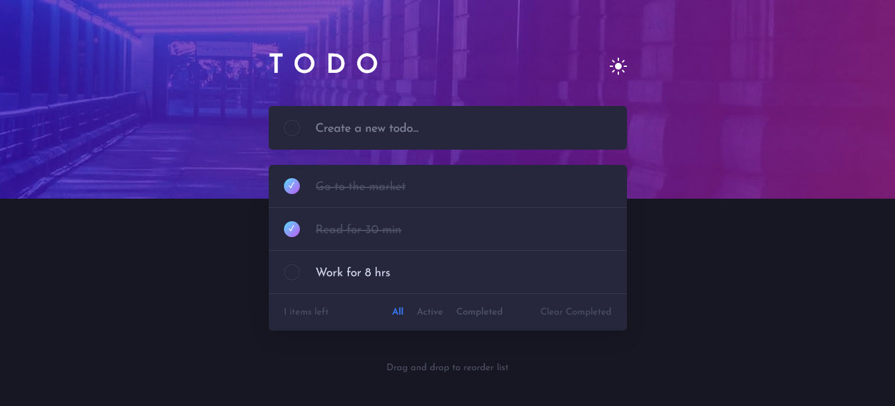
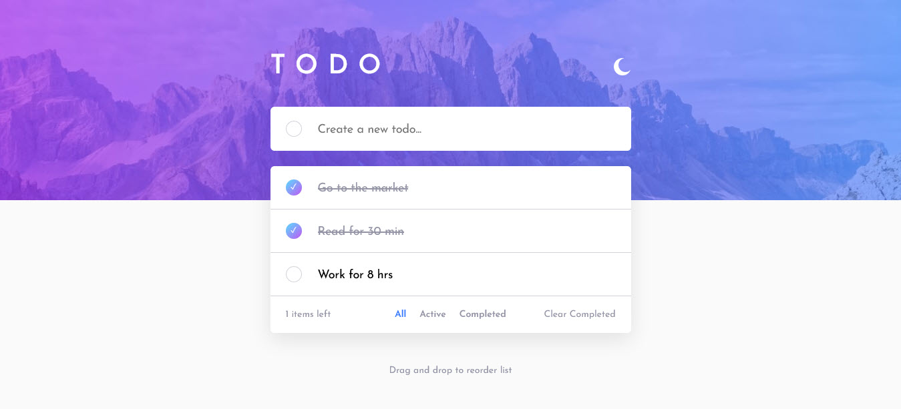

# Frontend Mentor - Todo app solution

This is a solution to the [Todo app challenge on Frontend Mentor](https://www.frontendmentor.io/challenges/todo-app-Su1_KokOW). Frontend Mentor challenges help you improve your coding skills by building realistic projects.

## Table of contents

- [Overview](#overview)
  - [The challenge](#the-challenge)
  - [Screenshot](#screenshot)
  - [Links](#links)
- [My process](#my-process)
  - [Built with](#built-with)
  - [Continued development](#continued-development)
- [Author](#author)

## Overview

### The challenge

Users should be able to:

- View the optimal layout for the app depending on their device's screen size
- See hover states for all interactive elements on the page
- Add new todos to the list
- Mark todos as complete
- Delete todos from the list
- Filter by all/active/complete todos
- Clear all completed todos
- Toggle light and dark mode
- **Bonus**: Drag and drop to reorder items on the list
- **Bonus**: save the todos list and theme preference when leaving the app 

### Screenshot

### Links

- Solution URL: [https://todo-an.netlify.app/](https://todo-an.netlify.app/)
- Live Site URL: [https://todo-an.netlify.app/](https://todo-an.netlify.app/)

## My process

### Built with

- Semantic HTML5 markup
- SASS #SCSS
- Flexbox
- MVC pattern
- desktop-first workflow
- BEM naming convension

### Continued development

I will focus on the MVC pattern as i found it very useful.

## Author

- Website - [https://github.com/AbdelrhmanNawar9](https://www.your-site.com)
- Frontend Mentor - [@AbdelrhmanNawar9](https://www.frontendmentor.io/profile/AbdelrhmanNawar9)
